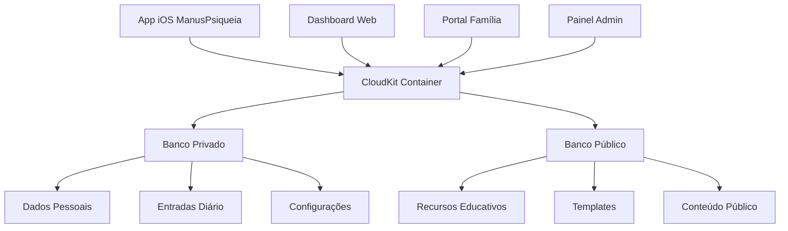

# 📊 Análise do CloudKit JS para ManusPsiqueia

**Data:** 23 de setembro de 2025  
**Projeto:** ManusPsiqueia  
**Tecnologia Analisada:** CloudKit JS da Apple

## 🎯 Visão Geral do CloudKit JS

O **CloudKit JS** é uma tecnologia da Apple que permite criar interfaces web que acessam os mesmos bancos de dados públicos e privados que aplicativos CloudKit nativos no iOS e macOS. É uma ponte poderosa entre aplicações nativas e web.

### **Características Principais**

- **Sincronização Bidirecional:** Dados compartilhados entre app iOS e interface web
- **Autenticação Apple ID:** Login unificado com a conta Apple do usuário
- **Bancos Públicos e Privados:** Acesso completo aos dados do CloudKit
- **APIs JavaScript Nativas:** Interface familiar para desenvolvedores web
- **Tempo Real:** Notificações push e atualizações em tempo real

## 🔗 Integração com ManusPsiqueia

### **Casos de Uso Estratégicos**

#### **1. Dashboard Web para Profissionais**
```javascript
// Exemplo de acesso aos dados do diário via CloudKit JS
CloudKit.configure({
    containers: [{
        containerIdentifier: 'iCloud.com.ailun.manuspsiqueia',
        apiTokenAuth: {
            apiToken: 'YOUR_API_TOKEN',
            persist: true
        },
        environment: 'production'
    }]
});

// Acessar registros de diário
const container = CloudKit.getDefaultContainer();
const database = container.privateCloudDatabase;

database.performQuery({
    recordType: 'DiaryEntry',
    filterBy: [{
        fieldName: 'patientID',
        comparator: 'EQUALS',
        fieldValue: { value: currentPatientID }
    }]
}).then(response => {
    // Processar entradas do diário
    const entries = response.records;
    displayDiaryEntries(entries);
});
```

#### **2. Portal de Família/Cuidadores**
- **Acesso Controlado:** Familiares podem acompanhar progresso (com permissão)
- **Relatórios Visuais:** Gráficos de humor e evolução
- **Comunicação:** Mensagens entre paciente, família e profissional

#### **3. Painel Administrativo**
- **Gestão de Usuários:** Administração de contas e assinaturas
- **Analytics Avançados:** Métricas de uso e engajamento
- **Suporte Técnico:** Acesso a logs e dados para resolução de problemas

### **Arquitetura de Integração**



## 🛠️ Implementação Técnica

### **1. Configuração Inicial**

#### **Pré-requisitos**
- Aplicativo CloudKit existente (✅ ManusPsiqueia já possui)
- Habilitação de Web Services no CloudKit Dashboard
- Geração de API Token ou Server-to-Server Key

#### **Setup no Projeto**
```html
<!DOCTYPE html>
<html>
<head>
    <script src="https://cdn.apple-cloudkit.com/ck/2/cloudkit.js"></script>
</head>
<body>
    <script>
        CloudKit.configure({
            containers: [{
                containerIdentifier: 'iCloud.com.ailun.manuspsiqueia',
                apiTokenAuth: {
                    apiToken: process.env.CLOUDKIT_API_TOKEN,
                    persist: true
                },
                environment: 'production'
            }]
        });
    </script>
</body>
</html>
```

### **2. Estrutura de Dados Compartilhada**

#### **Tipos de Registro CloudKit**
```swift
// No app iOS - definir esquemas
struct DiaryEntry: CKRecord {
    var content: String
    var mood: Int
    var date: Date
    var patientID: String
    var isPrivate: Bool
}

struct ProgressReport: CKRecord {
    var weeklyMood: [Int]
    var insights: String
    var generatedDate: Date
    var patientID: String
}

struct SharedResource: CKRecord {
    var title: String
    var content: String
    var category: String
    var isPublic: Bool
}
```

#### **Acesso via JavaScript**
```javascript
// Buscar entradas do diário
async function fetchDiaryEntries(patientID) {
    const database = CloudKit.getDefaultContainer().privateCloudDatabase;
    
    try {
        const response = await database.performQuery({
            recordType: 'DiaryEntry',
            filterBy: [{
                fieldName: 'patientID',
                comparator: 'EQUALS',
                fieldValue: { value: patientID }
            }],
            sortBy: [{
                fieldName: 'date',
                ascending: false
            }]
        });
        
        return response.records.map(record => ({
            id: record.recordName,
            content: record.fields.content.value,
            mood: record.fields.mood.value,
            date: new Date(record.fields.date.value),
            isPrivate: record.fields.isPrivate.value
        }));
    } catch (error) {
        console.error('Erro ao buscar entradas:', error);
        throw error;
    }
}

// Criar relatório de progresso
async function createProgressReport(data) {
    const database = CloudKit.getDefaultContainer().privateCloudDatabase;
    
    const record = {
        recordType: 'ProgressReport',
        fields: {
            weeklyMood: { value: data.weeklyMood },
            insights: { value: data.insights },
            generatedDate: { value: new Date() },
            patientID: { value: data.patientID }
        }
    };
    
    try {
        const response = await database.saveRecords([record]);
        return response.records[0];
    } catch (error) {
        console.error('Erro ao criar relatório:', error);
        throw error;
    }
}
```

### **3. Autenticação e Segurança**

#### **Fluxo de Autenticação**
```javascript
// Verificar status de autenticação
CloudKit.getDefaultContainer().setUpAuth()
    .then(userInfo => {
        if (userInfo) {
            console.log('Usuário autenticado:', userInfo.userRecordName);
            initializeApp(userInfo);
        } else {
            showLoginButton();
        }
    });

// Processo de login
function authenticateUser() {
    CloudKit.getDefaultContainer().requestApplicationPermission('WRITE')
        .then(result => {
            if (result.permission === 'GRANTED') {
                console.log('Permissão concedida');
                loadUserData();
            } else {
                console.log('Permissão negada');
                showPermissionError();
            }
        });
}
```

## 🎨 Interfaces Web Propostas

### **1. Dashboard Profissional**

#### **Funcionalidades**
- **Visão Geral de Pacientes:** Lista com status e alertas
- **Análise de Tendências:** Gráficos de humor ao longo do tempo
- **Relatórios Automatizados:** Gerados pela IA do app
- **Comunicação:** Chat seguro com pacientes
- **Agendamento:** Integração com calendário

#### **Tecnologias**
- **Frontend:** React.js + CloudKit JS
- **Visualização:** Chart.js ou D3.js
- **UI Framework:** Tailwind CSS
- **Estado:** Redux Toolkit

### **2. Portal da Família**

#### **Funcionalidades**
- **Progresso do Ente Querido:** Métricas de bem-estar (com permissão)
- **Recursos Educativos:** Artigos sobre saúde mental
- **Comunicação Familiar:** Mensagens de apoio
- **Alertas:** Notificações sobre marcos importantes

#### **Controles de Privacidade**
- **Opt-in Explícito:** Paciente deve autorizar cada tipo de compartilhamento
- **Granularidade:** Controle fino sobre quais dados compartilhar
- **Auditoria:** Log de todos os acessos familiares

### **3. Painel Administrativo**

#### **Funcionalidades**
- **Gestão de Usuários:** CRUD completo de contas
- **Analytics de Negócio:** Métricas de retenção e engajamento
- **Suporte Técnico:** Ferramentas de diagnóstico
- **Configurações Globais:** Parâmetros do sistema

## 📈 Benefícios Estratégicos

### **Para Usuários**
- **Acesso Multiplataforma:** Dados disponíveis em qualquer dispositivo
- **Sincronização Automática:** Sempre atualizados
- **Backup Seguro:** Dados protegidos no iCloud
- **Compartilhamento Controlado:** Privacidade garantida

### **Para Profissionais**
- **Visão Abrangente:** Acesso completo aos dados dos pacientes
- **Eficiência:** Menos tempo em tarefas administrativas
- **Insights Avançados:** Analytics poderosos
- **Flexibilidade:** Trabalho remoto facilitado

### **Para AiLun Tecnologia**
- **Diferenciação:** Poucos competidores oferecem integração web
- **Escalabilidade:** Atender diferentes tipos de usuários
- **Monetização:** Novos modelos de assinatura (web + mobile)
- **Ecossistema:** Plataforma completa de saúde mental

## 🚀 Roadmap de Implementação

### **Fase 1: Fundação (4-6 semanas)**
1. **Configurar CloudKit Web Services**
2. **Criar API tokens e chaves de servidor**
3. **Desenvolver dashboard básico para profissionais**
4. **Implementar autenticação Apple ID**

### **Fase 2: Dashboard Profissional (6-8 semanas)**
1. **Interface de visualização de dados**
2. **Gráficos e relatórios**
3. **Sistema de notificações**
4. **Ferramentas de comunicação**

### **Fase 3: Portal da Família (4-6 semanas)**
1. **Interface simplificada**
2. **Controles de privacidade**
3. **Recursos educativos**
4. **Sistema de permissões**

### **Fase 4: Painel Administrativo (6-8 semanas)**
1. **Gestão de usuários**
2. **Analytics avançados**
3. **Ferramentas de suporte**
4. **Configurações do sistema**

### **Fase 5: Otimização (4 semanas)**
1. **Performance e caching**
2. **Testes de carga**
3. **Refinamento da UX**
4. **Documentação completa**

## 💰 Considerações de Negócio

### **Modelos de Monetização**
- **Plano Profissional Web:** R$ 99/mês para psicólogos
- **Plano Família:** R$ 19/mês adicional para acesso familiar
- **Plano Institucional:** R$ 299/mês para clínicas

### **Custos de Desenvolvimento**
- **Desenvolvimento:** 20-24 semanas (1 desenvolvedor full-time)
- **Design UX/UI:** 4-6 semanas
- **Testes e QA:** 4 semanas
- **Total Estimado:** R$ 150.000 - R$ 200.000

### **ROI Projetado**
- **Break-even:** 6-8 meses após lançamento
- **Receita Adicional Anual:** R$ 500.000 - R$ 1.000.000
- **Diferenciação Competitiva:** Significativa

## ⚠️ Considerações Técnicas

### **Limitações do CloudKit JS**
- **Dependência da Apple:** Vendor lock-in
- **Limitações de Quota:** Limites de requisições e armazenamento
- **Compatibilidade:** Apenas navegadores modernos
- **Offline:** Funcionalidade limitada sem conexão

### **Alternativas Consideradas**
- **Supabase + Sync:** Mais flexível, mas requer sincronização manual
- **Firebase:** Google ecosystem, mas sem integração nativa iOS
- **Backend Próprio:** Máximo controle, mas maior complexidade

### **Recomendação**
**CloudKit JS é a escolha ideal** para ManusPsiqueia porque:
- Integração nativa perfeita com o app iOS existente
- Sincronização automática e confiável
- Segurança e privacidade da Apple
- Redução significativa da complexidade de backend

## 🎯 Conclusão

A integração do **CloudKit JS** no ecossistema ManusPsiqueia representa uma **oportunidade estratégica excepcional** para:

1. **Expandir o alcance** para profissionais e famílias
2. **Diferenciar-se** significativamente da concorrência
3. **Aumentar a receita** com novos modelos de assinatura
4. **Melhorar a experiência** de todos os stakeholders

**Recomendação:** Iniciar imediatamente a **Fase 1** do roadmap, priorizando o dashboard profissional como MVP para validar o conceito e gerar receita inicial.

---

**Analisado por:** Manus AI  
**Para:** AiLun Tecnologia (CNPJ: 60.740.536/0001-75)  
**Próxima Ação:** Configurar CloudKit Web Services e iniciar desenvolvimento do dashboard profissional
