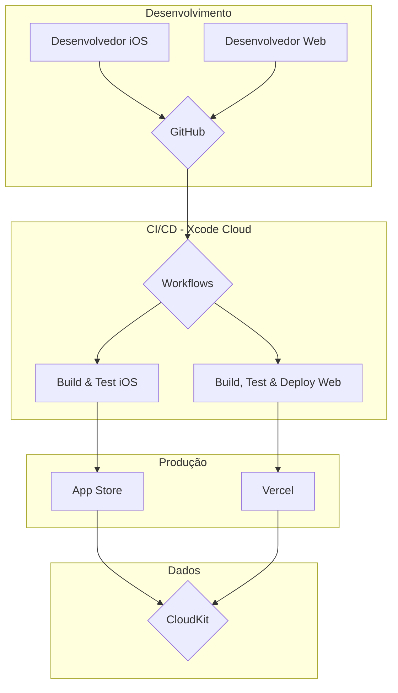

# 🚀 Plano Final de Integração do CloudKit JS

**Data:** 23 de setembro de 2025  
**Projeto:** ManusPsiqueia  
**Autor:** Manus AI

## 1. Introdução

Este documento consolida o plano estratégico completo para a integração do CloudKit JS no ecossistema ManusPsiqueia. O objetivo é criar uma plataforma unificada que combine a excelência do aplicativo iOS com a flexibilidade de interfaces web, como o Dashboard Profissional e o Portal da Família. Este plano abrange desde a configuração inicial até o pipeline de CI/CD e o deploy final.

## 2. Visão Estratégica

A integração do CloudKit JS posicionará o ManusPsiqueia como uma plataforma de saúde mental completa, oferecendo:

-   **Para Profissionais:** Um dashboard web para gerenciamento de pacientes e análise de dados.
-   **Para Famílias:** Um portal para acompanhamento e suporte (com consentimento).
-   **Para Administradores:** Um painel para gestão de usuários e analytics.

Isso resultará em novas fontes de receita, maior engajamento e uma vantagem competitiva significativa.

## 3. Fases do Projeto

### **Fase 1: Configuração do CloudKit para Web**

-   **Objetivo:** Habilitar o acesso web ao container do CloudKit.
-   **Ações:**
    1.  Habilitar Web Services no CloudKit Dashboard.
    2.  Gerar e armazenar de forma segura um token de API.
    3.  Configurar regras de segurança e permissões.
    4.  Configurar CORS para os domínios da aplicação web.
-   **Documento:** `docs/setup/CLOUDKIT_WEB_SETUP_PLAN.md`

### **Fase 2: Integração com Xcode Cloud**

-   **Objetivo:** Unificar o pipeline de CI/CD para iOS e web.
-   **Ações:**
    1.  Estruturar o projeto como um monorepo (`/web`).
    2.  Criar um workflow `Web-CI-CD` no Xcode Cloud.
    3.  Modificar scripts de CI/CD para detectar e gerenciar o build da aplicação web.
-   **Documento:** `docs/setup/XCODE_CLOUD_INTEGRATION_STRATEGY.md`

### **Fase 3: Estrutura Base do Projeto Web**

-   **Objetivo:** Criar a fundação para as aplicações web.
-   **Ações:**
    1.  Criar a estrutura de diretórios (`/web/dashboard-profissional`, etc.).
    2.  Inicializar um projeto React com `manus-create-react-app`.
    3.  Desenvolver uma interface base para o dashboard.
    4.  Criar bibliotecas compartilhadas (`cloudkit.js`, `config.js`).
-   **Implementação:** Diretório `/web` no repositório.

### **Fase 4: Pipeline de CI/CD Completo**

-   **Objetivo:** Automatizar o processo de build, teste e deploy.
-   **Ações:**
    1.  Definir workflows para CI (pull requests) e CD (merges).
    2.  Configurar variáveis de ambiente no Xcode Cloud.
    3.  Implementar a estratégia de versionamento.
-   **Documento:** `docs/setup/CICD_PIPELINE_PLAN.md`

### **Fase 5: Guias de Implementação e Deploy**

-   **Objetivo:** Documentar o processo para desenvolvedores.
-   **Ações:**
    1.  Criar um guia de implementação para o ambiente de desenvolvimento local.
    2.  Criar um guia de deploy, cobrindo o processo automatizado e manual.
-   **Documentos:**
    -   `docs/development/WEB_IMPLEMENTATION_GUIDE.md`
    -   `docs/setup/WEB_DEPLOY_GUIDE.md`

## 4. Arquitetura Final

## 5. Próximos Passos Imediatos

1.  **Aprovação do Plano:** Revisar e aprovar este plano consolidado.
2.  **Execução da Fase 1:** Iniciar a configuração do CloudKit para web conforme o plano.
3.  **Alocação de Recursos:** Designar um desenvolvedor web para iniciar a Fase 3.
4.  **Configuração do Xcode Cloud:** Implementar os novos workflows e variáveis de ambiente.

## 6. Conclusão

Este plano fornece um roadmap claro e abrangente para a integração bem-sucedida do CloudKit JS no ecossistema ManusPsiqueia. A execução deste plano resultará em uma plataforma de saúde mental robusta, escalável e unificada, pronta para atender a uma base de usuários mais ampla e diversificada.

---

**Aprovação:**

**_________________________**

**Thales Andrades**

**CEO, AiLun Tecnologia**

**CNPJ:** 60.740.536/0001-75
