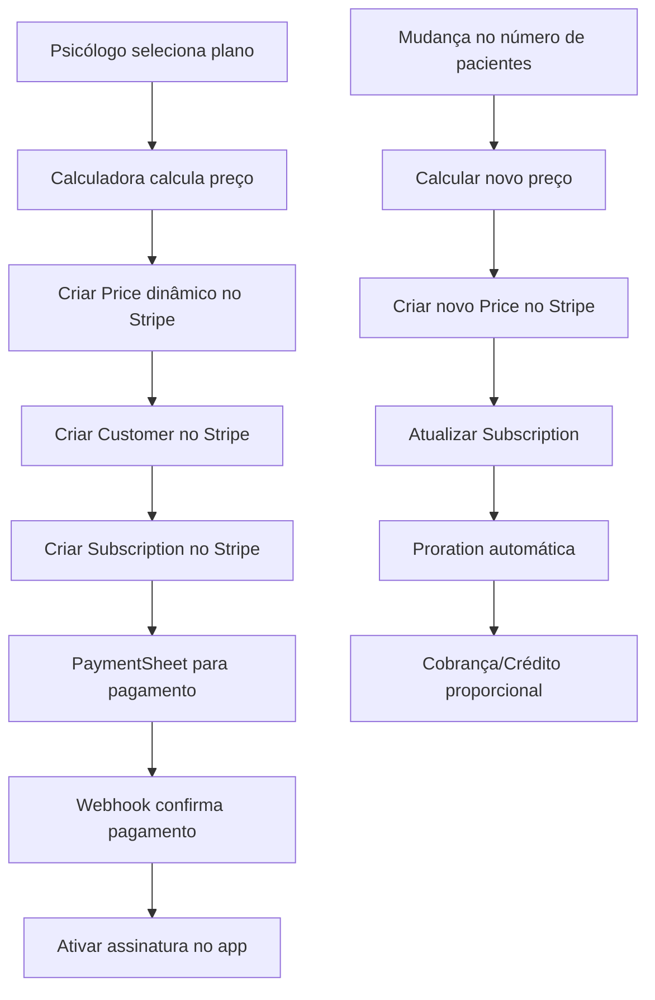

# 🔗 Integração Stripe com Precificação Dinâmica - ManusPsiqueia

## 🎯 Visão Geral da Integração

A integração entre o **sistema de precificação dinâmica** e o **Stripe** é o coração financeiro do ManusPsiqueia. Ela permite criar, modificar e gerenciar assinaturas em tempo real baseadas no número de pacientes e recursos selecionados.

## 🏗️ Arquitetura da Integração

### 📊 **Fluxo Completo de Integração**



## 🔧 Implementação Técnica Detalhada

### 1️⃣ **Criação de Preços Dinâmicos**

```swift
// Função para criar preço dinâmico no Stripe
private func createDynamicPrice(
    amount: Int,
    patientCount: Int,
    features: [PlanFeature]
) async throws -> String {
    
    let featureNames = features.map { $0.name }.joined(separator: ", ")
    
    let requestBody: [String: Any] = [
        "unit_amount": amount,                    // Preço em centavos
        "currency": "brl",                       // Real brasileiro
        "recurring": [
            "interval": "month",                 // Cobrança mensal
            "usage_type": "licensed"             // Baseado em licenças
        ],
        "product_data": [
            "name": "ManusPsiqueia - Plano Personalizado",
            "description": "Plano para \(patientCount) pacientes com recursos: \(featureNames)",
            "metadata": [
                "patient_count": patientCount,
                "feature_count": features.count,
                "plan_type": "dynamic",
                "created_by": "manuspsiqueia_app"
            ]
        ],
        "metadata": [
            "patient_count": patientCount,
            "features": featureNames,
            "tier": findBestTier(for: patientCount).name
        ]
    ]
    
    let response = try await makeStripeAPIRequest(
        endpoint: "prices",
        method: "POST",
        body: requestBody
    )
    
    return response["id"] as! String
}
```

### 2️⃣ **Criação de Customer Personalizado**

```swift
private func createOrGetStripeCustomer(_ psychologistId: String) async throws -> String {
    // Verificar se customer já existe
    if let existingCustomerId = UserDefaults.standard.string(forKey: "stripe_customer_id_\(psychologistId)") {
        return existingCustomerId
    }
    
    // Buscar dados do psicólogo
    let psychologist = try await fetchPsychologistData(psychologistId)
    
    let requestBody: [String: Any] = [
        "email": psychologist.email,
        "name": psychologist.name,
        "phone": psychologist.phone ?? "",
        "address": [
            "country": "BR",
            "state": psychologist.state ?? "",
            "city": psychologist.city ?? ""
        ],
        "metadata": [
            "psychologist_id": psychologistId,
            "platform": "ManusPsiqueia",
            "registration_date": ISO8601DateFormatter().string(from: Date()),
            "crp_number": psychologist.crpNumber ?? "",
            "specialty": psychologist.specialty ?? ""
        ],
        "tax_id_data": [
            [
                "type": "br_cpf",
                "value": psychologist.cpf
            ]
        ]
    ]
    
    let response = try await makeStripeAPIRequest(
        endpoint: "customers",
        method: "POST",
        body: requestBody
    )
    
    let customerId = response["id"] as! String
    UserDefaults.standard.set(customerId, forKey: "stripe_customer_id_\(psychologistId)")
    
    return customerId
}
```

### 3️⃣ **Criação de Subscription Dinâmica**

```swift
private func createStripeSubscriptionWithPrice(
    customerId: String,
    priceId: String,
    patientCount: Int,
    features: [PlanFeature]
) async throws -> String {
    
    let requestBody: [String: Any] = [
        "customer": customerId,
        "items": [
            [
                "price": priceId,
                "quantity": 1                    // Sempre 1 para planos personalizados
            ]
        ],
        "payment_behavior": "default_incomplete",
        "payment_settings": [
            "save_default_payment_method": "on_subscription",
            "payment_method_types": ["card", "boleto"]  // Cartão e boleto
        ],
        "expand": ["latest_invoice.payment_intent"],
        "collection_method": "charge_automatically",
        "billing_cycle_anchor": calculateNextBillingDate(),
        "proration_behavior": "always_invoice",
        "metadata": [
            "platform": "ManusPsiqueia",
            "subscription_type": "dynamic",
            "patient_count": patientCount,
            "features": features.map { $0.name }.joined(separator: ","),
            "created_at": ISO8601DateFormatter().string(from: Date())
        ],
        "automatic_tax": [
            "enabled": true                      // Cálculo automático de impostos
        ]
    ]
    
    let response = try await makeStripeAPIRequest(
        endpoint: "subscriptions",
        method: "POST",
        body: requestBody
    )
    
    return response["id"] as! String
}
```

## 🔄 Atualização Dinâmica de Assinaturas

### 📈 **Cenário: Psicólogo adiciona 5 pacientes**

```swift
func updateSubscriptionForNewPatients(newPatientCount: Int) async throws {
    guard let subscription = currentSubscription else { return }
    
    // 1. Calcular novo preço
    let calculator = DynamicPricingCalculator()
    let newTier = calculator.findBestTier(for: newPatientCount)
    let newPrice = calculator.calculateTotalPrice(
        patientCount: newPatientCount,
        selectedFeatures: subscription.selectedFeatures
    )
    
    // 2. Criar novo Price no Stripe
    let newPriceId = try await createDynamicPrice(
        amount: newPrice,
        patientCount: newPatientCount,
        features: subscription.selectedFeatures
    )
    
    // 3. Atualizar Subscription no Stripe
    let requestBody: [String: Any] = [
        "items": [
            [
                "id": subscription.stripeSubscriptionItemId!,
                "price": newPriceId
            ]
        ],
        "proration_behavior": "always_invoice",    // Sempre gerar fatura proporcional
        "billing_cycle_anchor": "unchanged",       // Manter data de cobrança
        "metadata": [
            "updated_at": ISO8601DateFormatter().string(from: Date()),
            "previous_patient_count": subscription.patientCount,
            "new_patient_count": newPatientCount,
            "update_reason": "patient_count_increase"
        ]
    ]
    
    let response = try await makeStripeAPIRequest(
        endpoint: "subscriptions/\(subscription.stripeSubscriptionId)",
        method: "POST",
        body: requestBody
    )
    
    // 4. Atualizar localmente
    var updatedSubscription = subscription
    updatedSubscription.patientCount = newPatientCount
    updatedSubscription.monthlyPrice = newPrice
    updatedSubscription.stripePriceId = newPriceId
    updatedSubscription.lastModified = Date()
    
    currentSubscription = updatedSubscription
    saveSubscription(updatedSubscription)
}
```

## 💰 Sistema de Proration (Cobrança Proporcional)

### 🧮 **Cálculo de Proration**

```swift
private func calculateProratedAmount(
    currentPrice: Int,
    newPrice: Int,
    billingDate: Date
) -> Int {
    let now = Date()
    let calendar = Calendar.current
    
    // Calcular dias restantes no ciclo atual
    let daysInMonth = calendar.range(of: .day, in: .month, for: now)?.count ?? 30
    let daysRemaining = calendar.dateComponents([.day], from: now, to: billingDate).day ?? 0
    
    // Fator de proporção
    let proratedFactor = Double(daysRemaining) / Double(daysInMonth)
    
    // Diferença de preço
    let priceDifference = newPrice - currentPrice
    
    // Valor proporcional
    let proratedAmount = Int(Double(priceDifference) * proratedFactor)
    
    return proratedAmount
}
```

### 📊 **Exemplo Prático de Proration**

```
Cenário: Psicólogo aumenta de 15 para 25 pacientes no dia 15 do mês

Preço atual: R$ 149,90 (R$ 14.990 centavos)
Novo preço: R$ 189,90 (R$ 18.990 centavos)
Diferença: R$ 40,00 (R$ 4.000 centavos)

Dias restantes: 15 dias
Dias no mês: 30 dias
Fator proporcional: 15/30 = 0.5

Cobrança proporcional: R$ 4.000 × 0.5 = R$ 2.000 centavos (R$ 20,00)

Resultado: Psicólogo paga R$ 20,00 agora e R$ 189,90 no próximo ciclo
```

## 🔔 Sistema de Webhooks

### 📡 **Webhooks Configurados**

```swift
// Webhooks que o ManusPsiqueia escuta do Stripe
let webhookEvents = [
    "invoice.payment_succeeded",      // Pagamento bem-sucedido
    "invoice.payment_failed",         // Falha no pagamento
    "customer.subscription.updated",  // Assinatura atualizada
    "customer.subscription.deleted",  // Assinatura cancelada
    "price.created",                 // Novo preço criado
    "customer.created",              // Novo cliente criado
    "payment_method.attached"        // Método de pagamento anexado
]

func handleWebhook(_ event: StripeEvent) async {
    switch event.type {
    case "invoice.payment_succeeded":
        await handleSuccessfulPayment(event)
    case "invoice.payment_failed":
        await handleFailedPayment(event)
    case "customer.subscription.updated":
        await handleSubscriptionUpdate(event)
    case "customer.subscription.deleted":
        await handleSubscriptionCancellation(event)
    default:
        print("Webhook não tratado: \(event.type)")
    }
}
```

### ✅ **Tratamento de Pagamento Bem-sucedido**

```swift
private func handleSuccessfulPayment(_ event: StripeEvent) async {
    guard let invoice = event.data.object as? StripeInvoice else { return }
    
    // Atualizar status da assinatura
    if var subscription = currentSubscription {
        subscription.status = .active
        subscription.lastPaymentDate = Date()
        subscription.nextBillingDate = Date(timeIntervalSince1970: invoice.nextPaymentAttempt)
        
        currentSubscription = subscription
        saveSubscription(subscription)
    }
    
    // Notificar usuário
    await sendPaymentSuccessNotification(invoice)
    
    // Atualizar analytics
    await updatePaymentAnalytics(invoice)
}
```

## 📊 Relatórios e Analytics

### 📈 **Métricas Financeiras em Tempo Real**

```swift
func getRealtimeFinancialMetrics() async throws -> FinancialMetrics {
    guard let subscription = currentSubscription else {
        throw StripeError.noActiveSubscription
    }
    
    // Buscar dados do Stripe
    let customer = try await getStripeCustomer(subscription.stripeCustomerId)
    let invoices = try await getRecentInvoices(subscription.stripeCustomerId)
    let usage = try await getCurrentUsage(subscription.stripeSubscriptionId)
    
    return FinancialMetrics(
        monthlyRecurringRevenue: subscription.monthlyPrice,
        totalPaid: invoices.reduce(0) { $0 + $1.amountPaid },
        averageRevenuePerPatient: subscription.monthlyPrice / max(1, subscription.patientCount),
        churnRate: calculateChurnRate(invoices),
        lifetimeValue: calculateLifetimeValue(customer, invoices),
        nextBillingAmount: try await getUpcomingInvoiceAmount(subscription.stripeCustomerId)
    )
}
```

### 💳 **Histórico de Pagamentos**

```swift
func getBillingHistory() async throws -> [BillingRecord] {
    guard let subscription = currentSubscription else {
        throw StripeError.noActiveSubscription
    }
    
    let response = try await makeStripeAPIRequest(
        endpoint: "invoices?customer=\(subscription.stripeCustomerId)&limit=50",
        method: "GET",
        body: nil
    )
    
    guard let invoicesData = response["data"] as? [[String: Any]] else {
        throw StripeError.invalidResponse
    }
    
    return invoicesData.compactMap { invoiceData in
        BillingRecord(
            id: invoiceData["id"] as? String ?? "",
            amount: invoiceData["amount_paid"] as? Int ?? 0,
            status: invoiceData["status"] as? String ?? "",
            date: Date(timeIntervalSince1970: invoiceData["created"] as? TimeInterval ?? 0),
            description: extractInvoiceDescription(invoiceData),
            pdfUrl: invoiceData["invoice_pdf"] as? String,
            patientCount: extractPatientCount(invoiceData),
            features: extractFeatures(invoiceData)
        )
    }
}
```

## 🔒 Segurança e Compliance

### 🛡️ **Proteção de Dados Financeiros**

```swift
class SecureStripeManager {
    // Chaves de API armazenadas no Keychain
    private func getStripeSecretKey() -> String? {
        return KeychainHelper.shared.get("stripe_secret_key")
    }
    
    // Criptografia de dados sensíveis
    private func encryptSensitiveData(_ data: [String: Any]) -> Data? {
        let jsonData = try? JSONSerialization.data(withJSONObject: data)
        return CryptoHelper.encrypt(jsonData)
    }
    
    // Validação de webhook signature
    private func validateWebhookSignature(_ payload: Data, signature: String) -> Bool {
        let webhookSecret = getWebhookSecret()
        return StripeWebhookValidator.validate(payload, signature: signature, secret: webhookSecret)
    }
}
```

### 📋 **Compliance PCI DSS**

```swift
// Nunca armazenar dados de cartão
struct PaymentMethod {
    let stripePaymentMethodId: String  // Apenas ID do Stripe
    let last4: String                  // Últimos 4 dígitos (seguro)
    let brand: String                  // Visa, Mastercard, etc.
    let expiryMonth: Int              // Mês de expiração
    let expiryYear: Int               // Ano de expiração
    
    // NUNCA armazenar:
    // - Número completo do cartão
    // - CVV
    // - Dados completos de expiração
}
```

## 🚀 Otimizações de Performance

### ⚡ **Cache Inteligente**

```swift
class StripeDataCache {
    private let cache = NSCache<NSString, AnyObject>()
    private let cacheTimeout: TimeInterval = 300 // 5 minutos
    
    func getCachedPrice(_ key: String) -> String? {
        if let cachedData = cache.object(forKey: key as NSString) as? CachedPrice,
           Date().timeIntervalSince(cachedData.timestamp) < cacheTimeout {
            return cachedData.priceId
        }
        return nil
    }
    
    func setCachedPrice(_ priceId: String, forKey key: String) {
        let cachedData = CachedPrice(priceId: priceId, timestamp: Date())
        cache.setObject(cachedData, forKey: key as NSString)
    }
}
```

### 🔄 **Retry Logic para APIs**

```swift
private func makeStripeAPIRequestWithRetry(
    endpoint: String,
    method: String,
    body: [String: Any]?,
    maxRetries: Int = 3
) async throws -> [String: Any] {
    
    var lastError: Error?
    
    for attempt in 1...maxRetries {
        do {
            return try await makeStripeAPIRequest(endpoint: endpoint, method: method, body: body)
        } catch {
            lastError = error
            
            // Exponential backoff
            let delay = pow(2.0, Double(attempt)) * 0.5
            try await Task.sleep(nanoseconds: UInt64(delay * 1_000_000_000))
        }
    }
    
    throw lastError ?? StripeError.networkError
}
```

## 📱 Interface do Usuário

### 💳 **PaymentSheet Personalizado**

```swift
struct DynamicPaymentSheet: View {
    @ObservedObject var stripeManager: DynamicStripeManager
    let subscription: DynamicSubscription
    
    var body: some View {
        VStack(spacing: 24) {
            // Resumo do plano
            PlanSummaryCard(subscription: subscription)
            
            // Detalhes de cobrança
            BillingDetailsCard(
                monthlyAmount: subscription.monthlyPrice,
                nextBillingDate: subscription.nextBillingDate,
                patientCount: subscription.patientCount
            )
            
            // PaymentSheet do Stripe
            if let paymentSheet = stripeManager.paymentSheet {
                PaymentSheet.PaymentButton(
                    paymentSheet: paymentSheet,
                    onCompletion: { result in
                        handlePaymentResult(result)
                    }
                ) {
                    Text("Confirmar Assinatura")
                        .font(.headline)
                        .foregroundColor(.white)
                        .frame(maxWidth: .infinity)
                        .frame(height: 56)
                        .background(Color.purple)
                        .clipShape(RoundedRectangle(cornerRadius: 16))
                }
            }
        }
        .padding(24)
    }
}
```

## 🎯 Casos de Uso Avançados

### 📊 **Upgrade Automático por Uso**

```swift
func handleAutomaticUpgrade() async {
    guard let usage = await getCurrentUsage() else { return }
    
    // Se utilização > 90%, fazer upgrade automático
    if usage.utilizationPercentage > 90 {
        let newPatientCount = Int(Double(usage.currentPatients) * 1.2) // 20% a mais
        
        try? await updateSubscriptionForNewPatients(newPatientCount)
        
        // Notificar psicólogo
        await sendUpgradeNotification(
            oldCount: usage.currentPatients,
            newCount: newPatientCount,
            reason: "Capacidade quase esgotada"
        )
    }
}
```

### 💰 **Desconto por Volume**

```swift
func applyVolumeDiscount(_ patientCount: Int) -> Double {
    switch patientCount {
    case 50...99:
        return 0.10  // 10% desconto
    case 100...199:
        return 0.15  // 15% desconto
    case 200...:
        return 0.20  // 20% desconto
    default:
        return 0.0   // Sem desconto
    }
}
```

## 📞 Suporte e Monitoramento

### 🔍 **Logs Detalhados**

```swift
func logStripeOperation(_ operation: String, details: [String: Any]) {
    let logEntry = StripeLogEntry(
        timestamp: Date(),
        operation: operation,
        details: details,
        psychologistId: currentSubscription?.psychologistId ?? "unknown"
    )
    
    StripeLogger.shared.log(logEntry)
    
    // Enviar para analytics se necessário
    if operation.contains("error") {
        AnalyticsManager.shared.trackError(logEntry)
    }
}
```

---

**Esta integração representa o estado da arte em precificação dinâmica SaaS, oferecendo flexibilidade total mantendo robustez e segurança de nível enterprise.**

**Desenvolvido por**: AiLun Tecnologia  
**CNPJ**: 60.740.536/0001-75  
**Email**: contato@ailun.com.br
