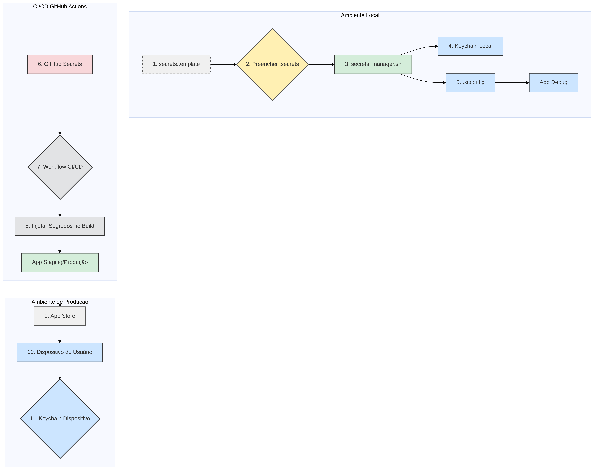

# Plano Estratégico de Gestão de Segredos

**Data:** 22 de setembro de 2025  
**Autor:** Manus AI  
**Projeto:** ManusPsiqueia

## 1. Introdução

A gestão inadequada de segredos (chaves de API, tokens, senhas) é uma das vulnerabilidades de segurança mais comuns e críticas em aplicações móveis. Este documento descreve um plano estratégico completo para gerenciar segredos no projeto ManusPsiqueia, garantindo que informações sensíveis nunca sejam expostas no código-fonte e que o acesso a elas seja rigorosamente controlado em todos os ambientes.

O objetivo deste plano é implementar uma solução robusta, segura e de fácil utilização para os desenvolvedores, seguindo as melhores práticas da indústria, como as recomendadas pelo OWASP Mobile Application Security Verification Standard (MASVS) [1].

## 2. Análise do Estado Atual

Anteriormente, o projeto armazenava algumas chaves de API e configurações diretamente no código-fonte ou em arquivos `Info.plist`. Essa abordagem apresentava riscos significativos:

-   **Exposição de Segredos:** Qualquer pessoa com acesso ao repositório poderia visualizar segredos de produção.
-   **Dificuldade de Rotação:** Alterar uma chave de API exigia uma nova compilação e deploy do aplicativo.
-   **Falta de Controle por Ambiente:** Não havia uma separação clara entre as configurações de desenvolvimento, staging e produção.

Com as melhorias recentes, foi implementada uma base sólida que inclui arquivos `.xcconfig`, um `ConfigurationManager` e um script de automação. Este plano formaliza e expande essa base.

## 3. Estratégia Proposta

A estratégia se baseia em uma abordagem multicamadas que combina configuração, automação e as funcionalidades de segurança nativas da Apple e do GitHub.

| Componente | Tecnologia | Responsabilidade |
| :--- | :--- | :--- |
| **Configuração de Build** | `.xcconfig` | Separar configurações por ambiente (Development, Staging, Production). |
| **Acesso no Código** | `ConfigurationManager.swift` | Fornecer um ponto de acesso único e seguro para todas as configurações. |
| **Armazenamento Local** | Keychain | Armazenar segredos de forma segura no ambiente de desenvolvimento local. |
| **Armazenamento em CI/CD** | GitHub Secrets | Gerenciar segredos de produção e staging de forma segura no pipeline de CI/CD. |
| **Automação** | `secrets_manager.sh` | Automatizar a configuração do ambiente local e a gestão de segredos. |

## 4. Fluxo de Gerenciamento de Segredos

O diagrama abaixo ilustra o fluxo completo de segredos, desde a configuração local até o deploy em produção.



**Descrição do Fluxo:**

1.  **Template:** O desenvolvedor começa com um arquivo `.secrets.template`.
2.  **Preenchimento:** Cria uma cópia local (ex: `development.secrets`) e preenche com as chaves do ambiente de desenvolvimento. Este arquivo é ignorado pelo Git.
3.  **Automação:** O script `secrets_manager.sh` é executado.
4.  **Keychain Local:** O script armazena os segredos do arquivo `.secrets` no Keychain do macOS, para uso local.
5.  **.xcconfig:** O script (ou o próprio Xcode) lê as configurações para o build.
6.  **GitHub Secrets:** Para os ambientes de Staging e Produção, os segredos são armazenados de forma segura no GitHub.
7.  **Workflow CI/CD:** O pipeline do GitHub Actions acessa os segredos de forma segura.
8.  **Injeção no Build:** Os segredos são injetados no aplicativo durante o processo de build, utilizando os arquivos `.xcconfig`.
9.  **App Store:** O aplicativo é enviado para a App Store sem conter segredos em texto plano.
10. **Dispositivo do Usuário:** O aplicativo é instalado no dispositivo do usuário.
11. **Keychain do Dispositivo:** Se necessário, o aplicativo pode usar o Keychain do dispositivo para armazenar informações sensíveis geradas durante o uso (ex: tokens de sessão).

## 5. Detalhes da Implementação

### Arquivos `.xcconfig`

Foram criados três arquivos de configuração (`Development.xcconfig`, `Staging.xcconfig`, `Production.xcconfig`), um para cada ambiente. Eles permitem definir variáveis de build que são acessadas pelo `Info.plist` e pelo `ConfigurationManager`.

> Exemplo de `Production.xcconfig`:
> ```xcconfig
> // Stripe Configuration
> STRIPE_PUBLISHABLE_KEY = $(STRIPE_PUBLISHABLE_KEY_PROD)
> 
> // Supabase Configuration
> SUPABASE_URL = $(SUPABASE_URL_PROD)
> ```

As variáveis com `$(...)` são preenchidas pelo processo de build do Xcode, que pode obtê-las de variáveis de ambiente (no caso do CI/CD) ou de outras fontes.

### `ConfigurationManager.swift`

Esta classe centraliza o acesso a todas as configurações. Ela detecta o ambiente atual e fornece os valores corretos, buscando-os em `Info.plist` ou diretamente do Keychain. Isso abstrai a complexidade de onde e como os segredos são armazenados.

### `scripts/secrets_manager.sh`

Este script de automação é fundamental para a experiência do desenvolvedor. Suas principais funções são:

-   **`setup`:** Cria a estrutura de diretórios e os templates de segredos.
-   **`validate`:** Verifica se um arquivo de segredos está preenchido corretamente.
-   **`keychain`:** Armazena os segredos de um arquivo `.secrets` no Keychain do macOS.
-   **`encrypt`/`decrypt`:** Permite criptografar e descriptografar arquivos de segredos para compartilhamento seguro (se necessário).

### GitHub Secrets

Os segredos dos ambientes de Staging e Produção devem ser armazenados exclusivamente no GitHub Secrets, na seção `Settings > Secrets and variables > Actions` do repositório. Eles são injetados como variáveis de ambiente durante a execução do workflow de CI/CD e passados para o build do Xcode.

## 6. Melhores Práticas de Segurança

-   **NUNCA** fazer commit de arquivos `.secrets` ou qualquer outro arquivo com segredos em texto plano.
-   **SEMPRE** usar o `ConfigurationManager` para acessar configurações e segredos.
-   **ROTACIONAR** as chaves de API regularmente e sempre que um desenvolvedor sair da equipe.
-   **CONCEDER** acesso aos segredos de produção apenas para pessoal autorizado.
-   **AUDITAR** o acesso aos segredos e a configuração dos ambientes periodicamente.

## 7. Roadmap de Melhorias

| Fase | Melhoria | Descrição | Prazo |
| :--- | :--- | :--- | :--- |
| **1** | **Validação no CI/CD** | Adicionar um passo no CI/CD para garantir que nenhum segredo foi adicionado acidentalmente ao código. | Q4 2025 |
| **2** | **Gestão Centralizada** | Integrar com um serviço de gestão de segredos como HashiCorp Vault ou AWS Secrets Manager para facilitar a rotação e auditoria. | Q1 2026 |
| **3** | **Criptografia de Configs** | Adicionar suporte para criptografar os arquivos `.xcconfig` no repositório usando `git-crypt`. | Q2 2026 |

## 8. Conclusão

Este plano estabelece uma base de segurança robusta para a gestão de segredos no projeto ManusPsiqueia. Ao combinar configuração por ambiente, automação e o uso de ferramentas seguras como Keychain e GitHub Secrets, a estratégia minimiza o risco de exposição de informações sensíveis, protege os dados dos usuários e garante a conformidade com as melhores práticas de segurança móvel.

## Referências

[1] OWASP. (2024). *Mobile Application Security Verification Standard (MASVS)*. Recuperado de https://owasp.org/www-project-mobile-app-security/
