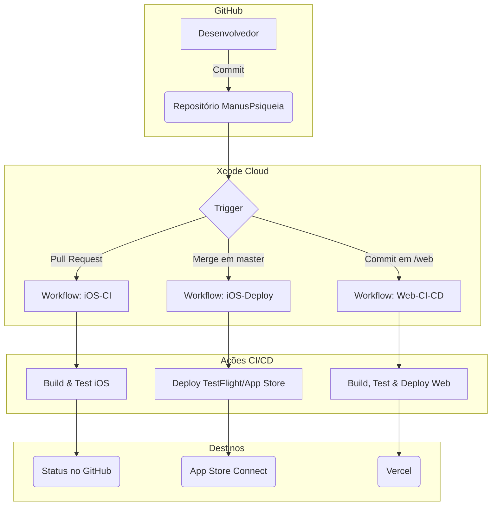

# 🚀 Plano de Pipeline de CI/CD Completo

**Data:** 23 de setembro de 2025  
**Projeto:** ManusPsiqueia  
**Fase:** 4 - Pipeline de CI/CD Completo

## 1. Introdução

Este documento detalha o plano para um pipeline de CI/CD completo e unificado, que gerencia tanto o aplicativo iOS quanto as aplicações web (Dashboard Profissional e Portal da Família). O objetivo é automatizar o processo de build, teste e deploy, garantindo qualidade e agilidade.

## 2. Ferramentas e Tecnologias

- **CI/CD:** Xcode Cloud
- **Repositório:** GitHub
- **Hospedagem Web:** Vercel (para aplicações React)
- **Gerenciador de Pacotes:** pnpm (para projetos web)
- **Automação:** Scripts shell (`.sh`)

## 3. Estrutura de Workflows no Xcode Cloud

Serão configurados três workflows principais no Xcode Cloud, cada um com um propósito específico.

### **Workflow 1: `iOS-CI` (Integração Contínua)**

- **Trigger:** Pull requests para a branch `master`
- **Objetivo:** Garantir que o novo código não quebre o projeto iOS.
- **Ações:**
    1.  **Build:** Compilar o app para iOS
    2.  **Testes:** Executar todos os testes unitários e de UI
    3.  **Análise Estática:** Executar SwiftLint
    4.  **Relatório:** Enviar status para o pull request no GitHub

### **Workflow 2: `iOS-Deploy` (Deploy para TestFlight/App Store)**

- **Trigger:** Merge na branch `master`
- **Objetivo:** Fazer o deploy de novas versões do app iOS.
- **Ações:**
    1.  **Build & Archive:** Gerar o build de produção
    2.  **Deploy para TestFlight:** Enviar para testadores internos
    3.  **Deploy para App Store:** (Manual) Submeter para revisão da Apple

### **Workflow 3: `Web-CI-CD` (CI/CD para Aplicações Web)**

- **Trigger:** Commits no diretório `/web` na branch `master`
- **Objetivo:** Fazer o deploy das aplicações web.
- **Ações:**
    1.  **`ci_post_clone.sh`:**
        -   Detectar qual projeto web foi modificado
        -   Instalar Node.js e pnpm
        -   Instalar dependências (`pnpm install`)
    2.  **`ci_pre_xcodebuild.sh`:**
        -   Configurar variáveis de ambiente (`CLOUDKIT_API_TOKEN`, `VERCEL_TOKEN`)
        -   Executar testes (`pnpm test`)
        -   Executar linting (`pnpm lint`)
    3.  **`ci_post_xcodebuild.sh`:**
        -   Executar build de produção (`pnpm run build`)
        -   Fazer deploy para Vercel (`vercel --prod --token $VERCEL_TOKEN --yes`)

## 4. Diagrama do Pipeline Completo

## 5. Configuração de Variáveis de Ambiente

As seguintes variáveis de ambiente serão configuradas no Xcode Cloud para cada workflow.

### **Para `iOS-Deploy`:**

-   `STRIPE_PUBLISHABLE_KEY_STAGING`
-   `SUPABASE_URL_STAGING`
-   `SUPABASE_ANON_KEY_STAGING`
-   `OPENAI_API_KEY_STAGING`

### **Para `Web-CI-CD`:**

-   `CLOUDKIT_API_TOKEN`
-   `VERCEL_TOKEN`
-   `VERCEL_PROJECT_ID_DASHBOARD`
-   `VERCEL_PROJECT_ID_PORTAL`

## 6. Estratégia de Versionamento

- **App iOS:** Versionamento semântico (ex: `1.2.3`). O número do build será incrementado automaticamente pelo Xcode Cloud.
- **Aplicações Web:** O deploy será contínuo. Cada commit na branch `master` no diretório `/web` resultará em um novo deploy para produção.

## 7. Próximos Passos

- **Criar guias de implementação e deploy** (Fase 5)
- **Consolidar plano final de integração** (Fase 6)

---

**Responsável:** Manus AI  
**Aprovação:** (Pendente)

