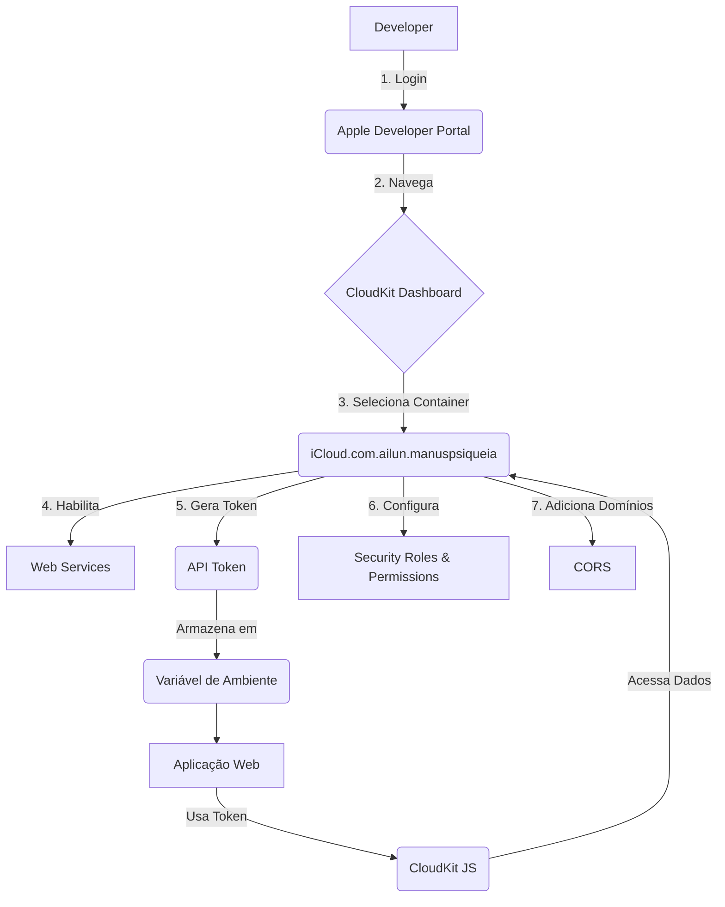

# ☁️ Plano de Configuração do CloudKit para Web

**Data:** 23 de setembro de 2025  
**Projeto:** ManusPsiqueia  
**Fase:** 1 - Configuração do CloudKit para Web

## 1. Introdução

Este documento detalha o plano de configuração do CloudKit para habilitar o acesso via web através do CloudKit JS. O objetivo é preparar o ambiente para o desenvolvimento de interfaces web que consumirão os dados do ManusPsiqueia, como o Dashboard Profissional e o Portal da Família.

## 2. Análise do Ambiente Atual

O projeto ManusPsiqueia já utiliza o CloudKit para sincronização de dados entre dispositivos iOS. A estrutura atual inclui:

- **Container:** `iCloud.com.ailun.manuspsiqueia`
- **Ambientes:** Development e Production
- **Tipos de Registro:** `DiaryEntry`, `User`, `Subscription`, etc.

Esta base sólida será estendida para suportar o acesso web.

## 3. Passos de Configuração

### **Passo 1: Habilitar Web Services**

A primeira etapa é habilitar o acesso via web no CloudKit Dashboard.

1.  **Acessar o CloudKit Dashboard:**
    -   Faça login em [developer.apple.com](https://developer.apple.com)
    -   Navegue para **Certificates, IDs & Profiles > CloudKit Dashboard**
    -   Selecione o container `iCloud.com.ailun.manuspsiqueia`

2.  **Habilitar Web Services:**
    -   No menu lateral, clique em **CloudKit JS e Web Services**
    -   Marque a opção **Habilitar Web Services**
    -   Esta ação expõe os endpoints necessários para o CloudKit JS

### **Passo 2: Gerar Token de API**

Para autenticar as requisições do CloudKit JS, é necessário um token de API.

1.  **Criar Token de API:**
    -   Ainda em **CloudKit JS e Web Services**, clique em **Gerar Token**
    -   Dê um nome descritivo ao token, como `WebApp-Token`
    -   Copie o token gerado e armazene-o de forma segura. **Este token não poderá ser visualizado novamente.**

2.  **Armazenamento Seguro:**
    -   O token de API será configurado como uma variável de ambiente no servidor da aplicação web (`CLOUDKIT_API_TOKEN`).
    -   **NUNCA** exponha o token diretamente no código frontend.

### **Passo 3: Configurar Segurança e Permissões**

É crucial definir regras de segurança para proteger os dados dos usuários.

1.  **Definir Regras de Segurança:**
    -   No CloudKit Dashboard, vá para **Schema > Security Roles**
    -   Crie um novo papel de segurança, como `WebAppUser`

2.  **Configurar Permissões:**
    -   Para o papel `WebAppUser`, defina as permissões de acesso aos tipos de registro:
        -   **`DiaryEntry`:** Leitura (Read) para profissionais autorizados
        -   **`User`:** Leitura (Read) para obter informações básicas
        -   **`SharedResource`:** Leitura (Read) para recursos públicos
    -   Configure permissões de escrita (Write) apenas para ações específicas, como criar relatórios.

### **Passo 4: Configurar CORS**

Para permitir que a aplicação web acesse o CloudKit, é necessário configurar o Cross-Origin Resource Sharing (CORS).

1.  **Adicionar Domínios Permitidos:**
    -   Em **CloudKit JS e Web Services**, na seção **CORS**, adicione os domínios da sua aplicação web:
        -   `https://dashboard.manuspsiqueia.com.br`
        -   `https://portal.manuspsiqueia.com.br`
        -   Para desenvolvimento: `http://localhost:3000`

## 4. Diagrama de Configuração



## 5. Validação

Após a configuração, a validação será feita com um simples teste de conexão via JavaScript:

```javascript
CloudKit.configure({
    containers: [{
        containerIdentifier: 'iCloud.com.ailun.manuspsiqueia',
        apiTokenAuth: {
            apiToken: 'SEU_TOKEN_AQUI',
            persist: true
        },
        environment: 'development'
    }]
});

const container = CloudKit.getDefaultContainer();

container.setUpAuth().then(userInfo => {
    if (userInfo) {
        console.log('✅ Conexão com CloudKit bem-sucedida!');
    } else {
        console.error('❌ Falha na autenticação com CloudKit');
    }
});
```

## 6. Próximos Passos

- **Desenvolver estratégia de integração com Xcode Cloud** (Fase 2)
- **Criar estrutura base do projeto web** (Fase 3)

---

**Responsável:** Manus AI  
**Aprovação:** (Pendente)
