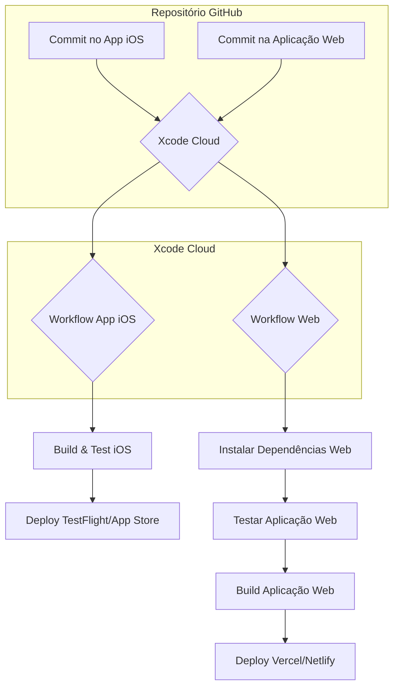

# ☁️ Estratégia de Integração com Xcode Cloud

**Data:** 23 de setembro de 2025  
**Projeto:** ManusPsiqueia  
**Fase:** 2 - Integração com Xcode Cloud

## 1. Introdução

Este documento descreve a estratégia para integrar o desenvolvimento da aplicação web (CloudKit JS) com o pipeline de CI/CD existente no Xcode Cloud. O objetivo é criar um fluxo de trabalho unificado que gerencie tanto o app iOS quanto a interface web, garantindo consistência e qualidade.

## 2. Desafios e Soluções

O principal desafio é que o Xcode Cloud é otimizado para projetos Apple (iOS, macOS, etc.) e não possui suporte nativo para projetos web (React, Vue, etc.).

**Solução:** Utilizar os **scripts de CI/CD** do Xcode Cloud para orquestrar o build e deploy da aplicação web em um serviço de hospedagem externo, como Vercel, Netlify ou AWS S3/CloudFront.

## 3. Estratégia de Integração

### **Estrutura do Repositório**

O projeto web será um monorepo, com a aplicação web residindo em um subdiretório:

```
/ManusPsiqueia
|-- /ManusPsiqueia (app iOS)
|-- /ManusPsiqueiaTests
|-- /web
|   |-- /dashboard-profissional
|   |   |-- /src
|   |   |-- package.json
|   |-- /portal-familia
|-- /ci_scripts
|-- Package.swift
```

### **Workflows no Xcode Cloud**

Serão criados workflows separados para o app iOS e para a aplicação web.

#### **Workflow App iOS (Existente)**
- **Triggers:** Commits na branch `master` ou `develop`
- **Ações:**
    1.  Build e teste do app iOS
    2.  Deploy para TestFlight (Staging)
    3.  Deploy para App Store (Production)

#### **Workflow Aplicação Web**
- **Triggers:** Commits no diretório `/web`
- **Ações:**
    1.  **`ci_post_clone.sh`:**
        -   Detectar qual projeto web foi modificado (`dashboard-profissional` ou `portal-familia`)
        -   Instalar dependências (Node.js, npm/yarn)
    2.  **`ci_pre_xcodebuild.sh`:**
        -   Configurar variáveis de ambiente (`CLOUDKIT_API_TOKEN`, etc.)
        -   Executar testes da aplicação web (`npm test`)
    3.  **`ci_post_xcodebuild.sh`:**
        -   Executar build da aplicação web (`npm run build`)
        -   Fazer deploy para o serviço de hospedagem (ex: Vercel CLI)

## 4. Diagrama de Fluxo CI/CD



## 5. Scripts de CI/CD (Exemplo)

### **`ci_post_clone.sh` (Modificado)**

```bash
#!/bin/sh

# ... (scripts existentes)

# --- Seção para Aplicação Web ---
echo "Verificando modificações na aplicação web..."

if git diff --name-only HEAD~1 HEAD | grep -q "^web/"; then
    echo "Modificações detectadas na aplicação web. Instalando dependências..."
    
    # Instalar Node.js e pnpm
    npm install -g pnpm
    
    cd web/dashboard-profissional
    pnpm install
    cd ../..
fi
```

### **`ci_post_xcodebuild.sh` (Modificado)**

```bash
#!/bin/sh

# ... (scripts existentes)

# --- Seção para Deploy da Aplicação Web ---
echo "Verificando se o deploy da aplicação web é necessário..."

if git diff --name-only HEAD~1 HEAD | grep -q "^web/"; then
    echo "Iniciando deploy da aplicação web..."
    
    # Configurar Vercel CLI
    npm install -g vercel
    
    # Fazer deploy
    cd web/dashboard-profissional
    vercel --prod --token $VERCEL_TOKEN --yes
    cd ../..
fi
```

## 6. Variáveis de Ambiente no Xcode Cloud

Serão adicionadas novas variáveis de ambiente para o deploy da aplicação web:

-   `VERCEL_TOKEN`: Token de acesso para a Vercel
-   `VERCEL_PROJECT_ID`: ID do projeto na Vercel
-   `CLOUDKIT_API_TOKEN`: Token de API do CloudKit JS

## 7. Próximos Passos

- **Criar estrutura base do projeto web** (Fase 3)
- **Definir pipeline de CI/CD completo** (Fase 4)

---

**Responsável:** Manus AI  
**Aprovação:** (Pendente)

