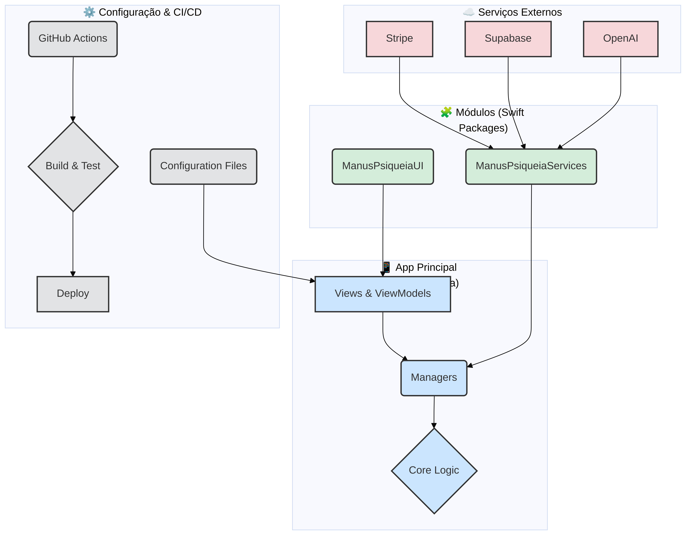

# Arquitetura do ManusPsiqueia

**Data:** 22 de setembro de 2025  
**Autor:** Manus AI

## Visão Geral

A arquitetura do ManusPsiqueia foi projetada para ser **modular, escalável, segura e de fácil manutenção**. Seguindo os princípios de design de software modernos para iOS, a arquitetura separa claramente as responsabilidades, promove a reutilização de código e garante uma base sólida para o crescimento futuro do aplicativo.

O diagrama abaixo ilustra a arquitetura de alto nível do projeto, mostrando a interação entre o aplicativo principal, os módulos, os serviços externos e o pipeline de CI/CD.

## Componentes da Arquitetura

A arquitetura é dividida em quatro camadas principais, cada uma com responsabilidades bem definidas.

### 1. 📱 Camada de Apresentação (App Principal)

Esta é a camada com a qual o usuário interage diretamente. Ela é responsável por exibir a interface do usuário (UI) e gerenciar o estado da aplicação.

-   **Views (SwiftUI):** Componentes de UI que compõem as telas do aplicativo. São construídos de forma declarativa e reativa, refletindo o estado atual do aplicativo.
-   **ViewModels (ObservableObject):** Objetos que preparam e fornecem dados para as Views. Eles contêm a lógica de apresentação e interagem com os `Managers` para obter e atualizar dados.
-   **Managers:** Classes que orquestram a lógica de negócio principal do aplicativo. Eles atuam como uma ponte entre a camada de apresentação e os serviços de backend, encapsulando a complexidade das operações.

### 2. 🧩 Camada de Módulos (Swift Packages)

Para promover a reutilização de código e a compilação mais rápida, a arquitetura foi modularizada em pacotes Swift independentes.

| Módulo | Descrição | Responsabilidades |
| :--- | :--- | :--- |
| **ManusPsiqueiaUI** | Contém todos os componentes de UI reutilizáveis. | - Botões, campos de texto, etc. - Sistema de temas (cores, fontes) - Animações e efeitos visuais |
| **ManusPsiqueiaServices** | Encapsula todas as integrações com serviços externos. | - Comunicação com a API backend - Integração com Stripe, Supabase, OpenAI - Serviços de segurança e criptografia |

### 3. ☁️ Camada de Serviços Externos

Esta camada representa os serviços de terceiros dos quais o ManusPsiqueia depende para suas funcionalidades principais.

-   **Stripe:** Processamento de pagamentos, assinaturas e gestão financeira.
-   **Supabase:** Backend como serviço (BaaS) para autenticação, banco de dados e armazenamento de arquivos.
-   **OpenAI:** Fornece os modelos de linguagem para as funcionalidades de inteligência artificial, como os insights do diário.

### 4. ⚙️ Camada de Configuração e Automação

Esta camada suporta o ciclo de vida de desenvolvimento, desde a configuração do ambiente até o deploy automatizado.

-   **Configuration Files (`.xcconfig`):** Arquivos de configuração que permitem gerenciar diferentes ambientes (Desenvolvimento, Staging, Produção) de forma segura, sem expor chaves de API no código.
-   **GitHub Actions (CI/CD):** Pipeline de integração e entrega contínua que automatiza as seguintes tarefas:
    -   Execução de testes unitários e de UI.
    -   Análise de qualidade e segurança do código.
    -   Geração de relatórios de cobertura de testes.
    -   Build e deploy para TestFlight (Staging) e App Store (Produção).

## Fluxo de Dados

O fluxo de dados na arquitetura segue um padrão unidirecional, o que torna o estado do aplicativo mais previsível e fácil de depurar.

1.  **Ação do Usuário:** O usuário interage com uma `View` (ex: toca em um botão).
2.  **Lógica de Apresentação:** A `View` chama uma função no `ViewModel` correspondente.
3.  **Lógica de Negócio:** O `ViewModel` utiliza um `Manager` para executar a lógica de negócio.
4.  **Serviços:** O `Manager` interage com os `Services` (no módulo `ManusPsiqueiaServices`) para se comunicar com as APIs externas.
5.  **Atualização de Estado:** Os `Services` retornam os dados, que são processados pelos `Managers` e atualizam o estado no `ViewModel`.
6.  **Re-renderização da UI:** Como o `ViewModel` é um `ObservableObject`, a `View` que o observa é automaticamente atualizada para refletir o novo estado.

## Princípios de Design

-   **Separação de Responsabilidades (SoC):** Cada componente tem uma única responsabilidade, tornando o código mais coeso e de fácil compreensão.
-   **Injeção de Dependência (DI):** As dependências são injetadas (ex: `Managers` nos `ViewModels`), o que facilita os testes e o desacoplamento dos componentes.
-   **Protocol-Oriented Programming (POP):** O uso de protocolos (ex: `NetworkServiceProtocol`) permite criar abstrações e implementações flexíveis, facilitando a criação de mocks para testes.
-   **Segurança por Design:** A segurança é uma preocupação central, com a gestão de segredos, pinning de certificados e outras medidas implementadas desde a base da arquitetura.

## Conclusão

A arquitetura modular e bem definida do ManusPsiqueia fornece uma base robusta para o desenvolvimento contínuo. Ela permite que a equipe de desenvolvimento adicione novas funcionalidades de forma rápida e segura, mantendo um alto padrão de qualidade e garantindo a escalabilidade do produto a longo prazo.
